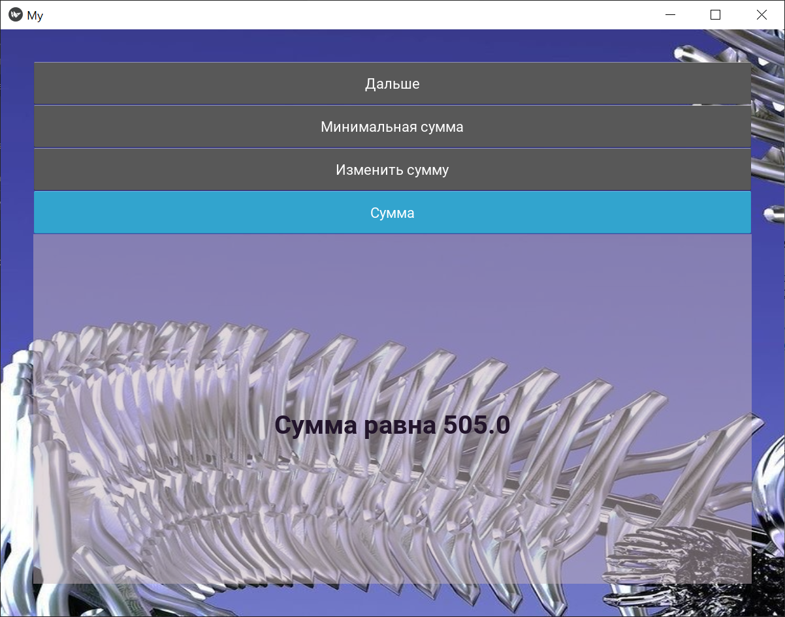
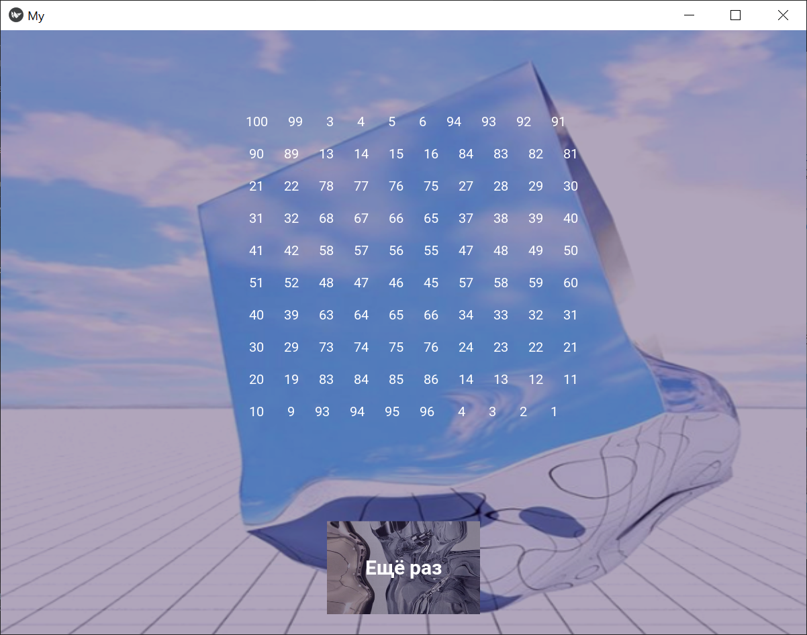

# Magic square
The "Magic Square" program is designed to generate magic squares based on user input and perform various operations on them. The program is implemented using the Kivy library in the Python programming language.

## Features

- Provides information about the magic square, including the minimum sum and the square itself.
- Generates magic squares based on input.
- Allows to increase the minimum sum of the magic square.

## Installation

1. Clone the repository:

   ```shell
   git clone https://github.com/your-username/magic-square.git
    ```
    
2. Change to the project directory:

   ```shell
   cd magic-square
   ```  
 
3. Install the required dependencies:
   
   ```shell
   pip install numpy
   ```
   
   ```shell
   pip install kivy
   ```
   
4. Run the program:

  ```shell
   python main.py
   ```
 
 # Program Functionality
 
 ## Main Window
- Displays basic information about the magic square.
- Allows the user to input the size of the magic square (a square matrix).
- Validates the input and calculates the minimum sum based on the size.
- Clicking on the "Next" button transitions to the Second Window.

<p align="center">
  
</p>
<!--  -->

## Second Window
- Displays the calculated minimum sum.
- Provides options to modify the minimum sum.
- Shows the updated sum based on user modifications.
- Clicking on the "Next" button transitions to the Third Window.
- Clicking on the "Reset" button resets the inputs and returns to the Main Window.

<p align="center">
  
</p>
<!--  -->

## Third Window
- Generates the magic square based on the user-defined parameters.
- Displays the generated magic square.
- Provides a button to repeat the process and return to the Main Window.

<p align="center">
  
</p>
<!--  -->

# Program Code
The program code is written in Python and utilizes the Kivy library for the graphical user interface. It consists of several classes representing different screens/windows and their corresponding functions. The code utilizes a combination of layouts, labels, buttons, and text input fields to implement the user interface.

The MainWindow class represents the first window/page, which takes user input and calculates the minimum sum. The SecondWindow class represents the second window/page, which displays the minimum sum and allows users to modify it. The ThirdWindow class represents the third window/page, which generates and displays the magic square. The WindowManager class manages the transition between different screens/windows.

The program uses the numpy library to generate the magic square. The algorithm for generating the magic square is implemented differently for even and odd-sized squares.

Please note that the provided code snippet may not run directly without the necessary dependencies and resources (e.g., my.kv file). Make sure to have the required resources and adjust the code as necessary for a complete and functional program.

Please let me know if you have any further questions or need additional assistance!
 
 
